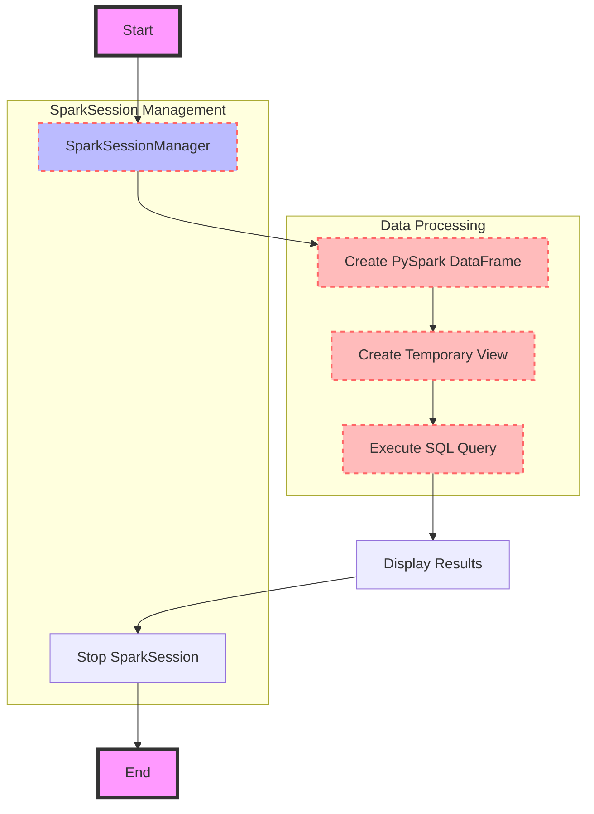

# Employee Boss using PySpark

### Instructions: 
- Write a Pyspark code to find the names of all employees and the name of their immediate boss. 
- If an employee does not have a boss, display "No Boss" for them.
- The output should be in the form of a list of tuples, where each tuple contains the name of the employee and the name of their boss.

## Table of Contents

1. [Project Structure](#project-structure)
2. [Components](#components)
3. [How It Works](#how-it-works)
4. [Usage](#usage)
5. [Sample Output](#sample-output)
6. [Extension Ideas](#extension-ideas)

## Project Structure

The project consists of three main Python files:

1. `spark_session.py`: Contains the SparkSessionManager class.
2. `data_generator.py`: Generates sample employee data.
3. `process_data.py`: Main script to process the data using PySpark.

## Components

### SparkSessionManager

This class implements the Singleton pattern for managing the SparkSession:

```python
class SparkSessionManager:
    _instance = None

    @classmethod
    def get_instance(cls):
        if cls._instance is None:
            cls._instance = SparkSession.builder.appName("EmployeeBoss").getOrCreate()
        return cls._instance

    @classmethod
    def stop_instance(cls):
        if cls._instance:
            cls._instance.stop()
            cls._instance = None
```

### Data Processor

The main data processing logic:

```python
def process_employee_data():
    spark = SparkSessionManager.get_instance()
    
    # Create DataFrame
    df = spark.createDataFrame(process_employee_data(), schema)
    
    # Create temporary view
    df.createOrReplaceTempView("employees")
    
    # Perform analysis
    result = spark.sql("""
        SELECT e.Name AS Employee,
               COALESCE(b.Name, 'No Boss') AS Boss,
               e.Role,
               e.Department,
               e.Salary
        FROM employees e
        LEFT JOIN employees b ON e.Boss = b.ID
        ORDER BY e.ID
    """)
    
    result.show()
```

## How It Works

1. The SparkSessionManager ensures a single SparkSession is used throughout the application.
2. Sample employee data is generated with a hierarchical structure.
3. The data is loaded into a PySpark DataFrame.
4. A SQL query is used to join the employee data with itself to find each employee's boss.
5. The results are displayed, showing each employee's name, their boss's name, role, department, and salary.

## Project Flow Diagram

The following diagram illustrates the flow of data and control in the Employee-Boss PySpark project:



## Usage

To run the project:

1. Ensure you have PySpark installed.
2. Run the main script:

```
python main.py
```

### Sample data:

```python
data = [
 (1, "Alice", None),
 (2, "Bob", 1),
 (3, "Carol", 2),
 (4, "Dave", 1),
 (5, "Eve", 2),
 (6, "Frank", 4)
]
```

```python
schema = ["ID", "Name", "Boss"]
```

### Result:

```text
+--------+-------+
|Employee|   Boss|
+--------+-------+
|   Alice|No Boss|
|     Bob|  Alice|
|   Carol|    Bob|
|    Dave|  Alice|
|     Eve|    Bob|
|   Frank|   Dave|
+--------+-------+
```
